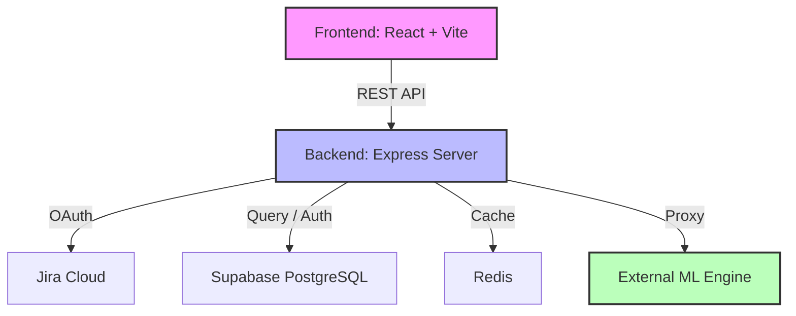

# ⚡ Velocity AI - Full Project Report

## 📖 Executive Summary
**Velocity AI** is an AI-powered project analytics and productivity intelligence platform. It acts as a central dashboard for engineering and project management teams to monitor project health, optimize team capacity, and make data-driven decisions.

By integrating with **Jira** (for task tracking) and **Supabase** (for user/data management), Velocity AI solves common management problems like data fragmentation, capacity forecasting, and skill-to-task matching.

---

## 🧩 Core Modules ("Sub-Projects")
The platform is composed of several key modules, each serving a specific business function:

### 1. 🔗 Jira Integration & Analytics
- **Purpose**: Connects to Jira Cloud to aggregate task data.
- **Features**:
  - Interactive **Gantt Charts** for project timelines.
  - **Burndown Charts** and velocity metrics for sprint tracking.
  - Multi-tenant support (switching between different Jira sites).
- **Location**: `src/components/jira/`, `src/pages/JiraDashboard.tsx`

### 2. 👥 Team & Capacity Management
- **Purpose**: Tracks who is working on what and when they are available.
- **Features**:
  - **Capacity Heatmaps** showing workload distribution.
  - **8-Week Forecasting** to predict future availability.
  - Integration with Leave Management to auto-adjust capacity.
- **Location**: `src/components/people/`, `src/components/PeopleCapacityScreen.tsx`

### 3. 📅 Leave Management & Approvals
- **Purpose**: Handles employee time-off requests with impact analysis.
- **Features**:
  - Automated or suggested leave approvals based on project load.
  - Team calendar views for managers.
- **Location**: `src/components/leave-management/`, `src/components/leave-approval/`

### 4. 🤖 AI & ML Engine (Predictive Insights)
- **Purpose**: Provides smart recommendations and identifies risks.
- **Features**:
  - **Skill Extraction**: Reads task titles/descriptions to identify needed skills.
  - **Hotspot Detection**: Flags at-risk projects before they delay.
  - **Availability Analysis**: Matches the best available person to a task.
- **Tech**: Proxies requests to an **External Python ML Engine**.
- **Location**: `src/components/ml-model/`, `api/ml.ts`

### 5. 👨‍💻 Employee Workspace
- **Purpose**: A dedicated view for team members (non-managers).
- **Features**:
  - Personal Dashboards showing assigned tasks and schedules.
  - Time tracking and leave request submission.
- **Location**: `src/pages/employee/`

---

## 🏗️ Technical Architecture

### Tech Stack Breakdown
*   **Frontend**: React (UI), TailwindCSS (Styling), TanStack Query (Data management), Recharts (Charts).
*   **Backend**: Node.js + Express (API layer), TypeScript.
*   **Database**: Supabase (PostgreSQL with Realtime capabilities).
*   **Caching**: Redis (for session and Jira data caching).
*   **ML**: Python Engine (hosted externally) for data science heavy lifting.

---

## 📁 Directory Structure Guide
For developers and administrators looking to navigate the codebase:

| Folder / File | Description |
| :--- | :--- |
| **`src/`** | The React Frontend application. |
| ├─ `components/` | Reusable UI modules (Jira, Leave, ML, People). |
| ├─ `pages/` | Main view templates (Dashboard, Login, Onboarding). |
| ├─ `contexts/` | Global state (Auth, Notifications). |
| **`server.ts`** | The Express Backend entry point. |
| **`api/`** | API route handlers (Jira, Leave, ML endpoints). |
| **`supabase-migrations/`** | Database schema versioning/setup. |
| **`scripts/`** | Utility/Maintenance scripts (logging, testing tools). |

---

## 🚀 How to Run (Brief)
1.  **Install**: Run `npm install` to load dependencies.
2.  **Environment**: Create `.env` using `.env.example` as a template (fill in Jira, Supabase keys).
3.  **Launch**:
    -   `npm run api` (Starts the backend proxy)
    -   `npm run dev` (Starts the frontend interface)
