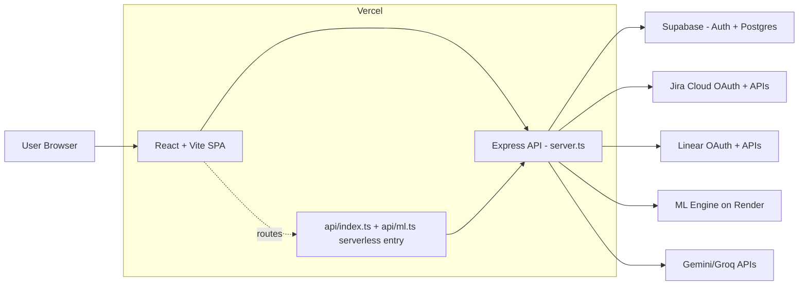

# Velocity AI

Velocity AI is a multi-tenant engineering operations platform that combines:
- project tracking (Jira + Linear),
- team/leave/time data (Supabase),
- AI-assisted planning and voice control,
- manager and employee dashboards.

It is built as a React + Vite frontend with an Express API layer (deployed as Vercel serverless functions).

---

## What this project does

### 1) Organization and user workflows
- Authentication via Supabase Auth.
- Organization onboarding, team setup, invite-code join flow.
- Role-based UI routing (manager/admin vs employee views).

### 2) Jira integration (primary external work system)
- Jira OAuth (multi-tenant, site switching).
- Project + issue sync from Jira into Supabase-backed tables.
- Jira dashboards, timeline/gantt views, team workload and project analytics.

### 3) Linear integration (optional)
- Linear OAuth connect/disconnect.
- Sync issues from Linear.
- Push approved tasks to Linear from AI suggestions.
- Log ML training events tied to approve/reject decisions.

### 4) AI and agent-assisted features
- **Project Planner Agent**: decomposes project descriptions into tasks (Google Gemma `gemma-4-31b-it`; ML fallback).
- **Voice Agent**: parses commands, supports navigation/actions/query intents with local + LLM fallback.
- **Leave Approval Agent**: weighted-scoring decision engine for leave approvals.
- **Smart Progress Agent**: updates progress from EOD-style report text using weighted scope completion.
- **ML Integration Service**: availability/bottleneck/capacity analysis via external Python ML engine.

### 5) Employee operations
- Leave request create/withdraw.
- Leave balances + leave type provisioning.
- Holidays and timesheet endpoints.
- Employee dashboard/task status/blocker flows.

---

## What this project does **not** do (current state)

- Server-side TTS is not implemented (`/api/voice/tts` returns “browser fallback”).
- Parts of the demo page are explicitly marked “coming soon”.
- Some prototype/demo flows still use mock/default data paths (for example in demo/deployed routes and fallback hooks).
- No dedicated automated test script is currently defined in `package.json` (lint/build scripts exist).

---

## Deployment map

### Frontend + API host
- **Platform:** Vercel
- **Main domain:** `https://www.joinvelocity.co`
- **Serverless entry:** `api/index.ts` (bridges to `server.ts`)
- **Rewrite config:** `vercel.json` routes `/api/*` to serverless handlers and all other routes to SPA.

### ML/AI backend services used by this repo
- **Python ML engine (Render):** `https://python-ml-engine-xlwh.onrender.com`
  - proxied in production via `/api/ml/*`
- Secondary endpoint is configured via `VITE_LLM_URL2` (present in environment config; purpose is currently not fully documented in this repo).

### Data/auth backend
- **Supabase** (Postgres + auth + storage logic used across routes/services).

---

## Architecture (high-level)



---

## User-side workflow (end-user journey)

### 1) Entry points (Login / Sign up)
- **Login page** supports:
  - Continue with **Google**
  - Continue with **Jira**
  - Continue with **email + password**
- **Sign-up page** supports:
  - Continue with **Google**
  - Continue with **Jira**
  - **Email sign-up** (name, email, password)

### 2) First-time path after authentication
- If user has no org/team mapping yet, app routes to onboarding.
- User chooses:
  - **Create a new team/workspace**, or
  - **Join existing team** via invite code.

### 3) Join existing team path
- User enters invite code in onboarding join screen.
- Team/org preview is shown for valid code.
- On success, user is routed to employee dashboard flow.

### 4) Employee workflow (member user)
- Open employee dashboard (`/app/employee/dashboard`).
- Work with:
  - My Projects
  - Project detail updates
  - Time + leave tab
  - Profile and preferences
- Employee APIs used include:
  - leave requests/types/balances
  - timesheets submit/upsert
  - task status/blocker updates

---

## Admin/manager workflow (workspace owner journey)

### 1) Authentication and start
- Admin can login/sign up via Google, Jira, or email/password.
- If not attached to org: routed to onboarding mode selection.

### 2) Create workspace path
- **Onboarding Welcome**:
  - enter organization name
  - enter first team name
  - optional voice-assisted fill for org/team info
- **Onboarding Team**:
  - add members manually
  - import members (CSV / paste / Jira import option)
  - assign role + skills
- Continue onboarding settings/holidays and complete setup.

### 3) Day-to-day admin operations
- Manager dashboard and AI dashboard:
  - project health, risk, capacity, burn/bottleneck indicators
  - AI recommendations and sync cards
- Project planning:
  - create project brief
  - decompose work with planner agent
  - allocate team
- Integrations:
  - connect/switch Jira site, sync projects/issues
  - optionally connect Linear and push approved tasks
- Governance:
  - organization settings
  - team invite regeneration
  - leave approval workflows (weighted scoring agent)

---

## AI agents used and their responsibilities

- **Voice Agent**
  - **Where:** `src/components/voice/VoiceAgent.tsx`, `src/services/geminiVoiceService.ts`, `src/api/voice/routes.ts`
  - **Purpose:** Voice command UX, intent parsing, navigation/actions, fallback local parsing
- **Project Planner Agent**
  - **Where:** `src/services/gemmaPlannerService.ts`, `src/components/PlanMyProjectScreen.tsx`
  - **Purpose:** Task decomposition from project brief
- **Leave Approval Agent**
  - **Where:** `src/lib/leaveApprovalAgent.ts`, `src/api/leave-approval/routes.ts`
  - **Purpose:** Weighted leave approval decisions and summary
- **Smart Progress Agent**
  - **Where:** `src/components/smart-progress/ProgressAgent.ts`
  - **Purpose:** EOD text → progress updates on scoped tasks
- **Project Insight Engine**
  - **Where:** `src/components/projects/insights/*`
  - **Purpose:** Risk detection, recommendations, optional LLM summarization
- **ML Engine Client**
  - **Where:** `src/services/mlService.ts`, `api/ml.ts`
  - **Purpose:** Availability/bottleneck/capacity calls to external Python service

---

## Backend services created in this repo

Mounted in `server.ts`:

- `/health`
- `/api/auth` (organization lookup via verified JWT)
- `/api/organization` (settings, holidays, org search/domain checks, teams/invite regeneration)
- `/api/invites` (create/list/join invite flows)
- `/api/employee` (leave requests/types/balances, timesheets, task updates, employee dashboard)
- `/api/jira` (OAuth, status, projects/issues sync, skill extraction, DB-backed reads)
- `/api/linear` (OAuth, sync, push task, ML event logging)
- `/api/voice` (parse, normalize, tts placeholder)
- `/api/leave-approval` (single/batch approval, weights, status, team-capacity)
- `/api/deployed` (legacy/prototype skill-reassign route)
- `/api/ai/expand-description` (Groq-powered project description expansion)
- `/api/waitlist` (waitlist insert to Supabase)
- `/api/ml/*` (Vercel function proxy in `api/ml.ts`)

---

## Current “working” picture (from code paths)

### Generally production-oriented and integrated
- Auth + protected routes.
- Org/team/holiday/leave core API routes.
- Jira OAuth + multi-site handling + DB-first data reads with API fallback.
- Linear OAuth + issue sync + push-task flow (when connected).
- Planner + voice + leave approval logic integrated in UI and API.

### Mixed maturity / prototype areas
- Demo page modules (several placeholders).
- Deployed demo route using mock task object.
- Some fallback/mock behavior retained to keep UX alive when APIs are unavailable.

---

## Tech stack

- **Frontend:** React, TypeScript, Vite, Tailwind, Radix/shadcn, React Query
- **Backend:** Express (TypeScript), node-fetch, express-session
- **Data/Auth:** Supabase
- **Integrations:** Jira Cloud OAuth, Linear OAuth
- **AI/LLM:** Google Generative AI SDK, Groq API, external Python ML service
- **Deployment:** Vercel serverless + Render-hosted ML service

---

## Local development

### Prerequisites
- Node.js 18+
- npm
- Supabase project and keys
- Jira OAuth app credentials (for Jira flows)

### Setup
```bash
npm install
```

Create `.env` from `.env.example`, then run:
```bash
npm run api
npm run dev
```

Build:
```bash
npm run build
```

Lint:
```bash
npm run lint
```

---

## Repository structure (high-level)

- `src/` – React app, pages, components, hooks, client services
- `server.ts` – Express app and API mounting
- `api/` – Vercel serverless entry points (`api/index.ts`, `api/ml.ts`, etc.)
- `src/api/` – route modules and DB-layer logic
- `supabase-migrations/` – SQL migrations/schema changes
- `scripts/` – utility/testing scripts
- `data/` / `public/data` – CSV and dataset assets used by specific features

---

## Notes

- This repository contains both production-grade flows and in-progress/demo modules.
- Keep credentials out of committed files; use environment variables only.
