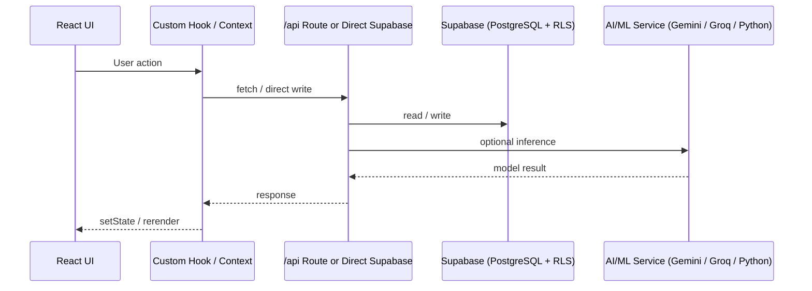

<div align="center">

# ⚡ Velocity AI

### AI-Native Engineering Operations Platform

[](https://www.typescriptlang.org/)
[](https://react.dev/)
[](https://vitejs.dev/)
[](https://tailwindcss.com/)
[](https://ui.shadcn.com/)
[](https://nodejs.org/)
[](https://expressjs.com/)
[](https://supabase.com/)
[](https://www.postgresql.org/)
[](https://deepmind.google/technologies/gemini/)
[](https://groq.com/)
[](https://python.org/)
[](https://www.atlassian.com/software/jira)
[](https://linear.app/)
[](https://vercel.com/)
[](https://render.com/)

<br/>

> A production-grade, multi-tenant AI platform unifying project planning, workforce management,  
> Jira/Linear integrations, engineering analytics, and voice-driven workflows — all in one runtime architecture.


</div>

---

## 📌 What is Velocity AI?

Velocity AI is a **full-stack, AI-native engineering operations platform** built to replace the fragmented ecosystem of tools most engineering teams live in. Rather than context-switching between Jira, Linear, spreadsheets, and stand-up calls, Velocity AI brings every layer of engineering ops into a single intelligent workspace.

| Layer | What It Does |
|---|---|
| 🧠 **AI Planning Engine** | Turns project briefs into structured, task-decomposed execution plans via LLM orchestration |
| 🎙️ **Voice Agent** | Natural-language commands parsed into live DB mutations via browser speech APIs + Gemini |
| 🔄 **Jira + Linear Sync** | OAuth-authenticated, DB-first hybrid sync with live API fallback and resilience handling |
| 👥 **Workforce Operations** | Leave management, AI-assisted approvals, workload balancing, and timesheet tracking |
| 📊 **Smart Progress Intelligence** | ML-powered delivery risk analysis, bottleneck detection, and per-employee workload insights |
| 🏢 **Multi-Tenant Architecture** | Full org isolation, invite-code workspace joining, RBAC, and guided onboarding flows |

---

## 🛠️ Tech Stack

### Frontend


Custom hook-driven architecture — no React Query. All state flows are hand-rolled contexts and hooks for fine-grained control over async auth, org resolution, and integration state machines.

### Backend


Express REST API with serverless functions for AI routes, OAuth callbacks, invite management, and ML proxy endpoints hosted on Render.

### Database & Auth


Supabase handles auth sessions, Row Level Security enforcement, and direct client SDK writes. On every `SIGNED_IN` event, org context (`orgId`, `orgRole`, `onboardingComplete`) is resolved via a dual-path lookup — API first, direct DB fallback.

### AI & ML


Multi-model stack: Gemini for planning and voice intent parsing, Groq for low-latency inference, Python ML engine on Render for bottleneck and workload analysis. Every AI flow includes a structured fallback path for model failures or malformed outputs.

### Integrations


Full OAuth 2.0 flows for both Jira and Linear. Hybrid DB-first read model — cached issues served from Supabase instantly, with live Atlassian/Linear API used as fallback or on forced sync trigger.

### Deployment


Frontend on Vercel, Python ML engine on Render. Serverless functions handle AI inference routes, OAuth redirect/callback cycles, and invite provisioning.

---

## ✨ Feature Deep-Dives

### 🧠 AI Project Planning Engine

Converts unstructured project briefs into fully decomposed, task-level execution plans.

- Prompt orchestration via `gemmaPlannerService.decomposeProject()` with strict JSON schema validation
- Malformed AI responses trigger an automatic fallback to the legacy Python ML engine
- Debounced autosave (`useAutoSavePlan`) persists plan drafts to `project_plans` / `plan_tasks`
- Plan tasks are **rewritten atomically on save** — no partial state accumulation
- State machine: `idle → analyzing → draft → saved` with UI/DB divergence detection

### 🎙️ Voice Agent System

A complete browser-based voice operations layer — beyond simple dictation.

- **5-state machine**: `idle → connecting → listening → processing → speaking/error`
- 3s silence timeout + 15s processing watchdog prevent stuck/frozen states
- `parseIntent()` routes commands to live Supabase mutations — tasks, leave requests, Linear pushes
- `summarizeData()` synthesizes dashboard state into spoken responses
- Confirmation branch pauses execution mid-flow and resumes listening for affirmation before committing

### 🔄 Jira + Linear Integration Layer

Not a simple webhook — a full hybrid sync architecture built for resilience.

- OAuth 2.0 connect/callback with token persistence in Supabase
- DB-first reads via `jiraDbClient` / `fetchLinearIssuesHybrid()` for instant UI load
- Live API fallback when cache is empty or a forced sync is triggered
- Sync (`POST /api/jira/sync`, `POST /api/linear/sync`) is fully decoupled from auth
- ML training events logged fire-and-forget on every Linear task push

### 👥 Workforce & Leave Management

Full lifecycle from request submission through approval to balance reconciliation.

- Parallel data loading: users, projects, leaves, balances, and leave types fetched simultaneously
- Approval + task shift: open tasks are re-assigned *before* leave is approved, then balance is deducted
- `LeaveApprovalAgent` — an AI-assisted batch approver with `AbortController` cancellation support
- Two coexisting approval systems: manual Supabase flow for production, `/api/leave-approval/*` for demo/testing

### 📊 Smart Progress Intelligence

ML-assisted delivery tracking and engineering health monitoring.

- Aggregates Jira issues and CSV data into a unified, normalized task model
- ML health check cached for 60s to avoid overloading the Python engine
- Bottleneck and workload analysis only runs when the ML engine is confirmed online; graceful local fallback otherwise
- Per-project issue fetches run sequentially with per-project failure isolation

### 🏢 Multi-Tenant Architecture

Full org isolation from login through every data operation.

- Org context (`orgId`, `orgRole`, `orgName`, `onboardingComplete`) resolved on every auth state change
- `prewarmServices()` fires immediately post-login to pre-cache org data
- Invite-code join flow is **server-authoritative** — server resolves org/team/role, client refreshes state after
- Sequential onboarding writes across `organizations`, `teams`, `users`, `team_members` with guided recovery on partial failure

---

## 🏗️ System Architecture



### Key Architectural Decisions

| Decision | Rationale |
|---|---|
| Custom hooks over React Query | Fine-grained control over auth-gated async flows and org context sequencing |
| DB-first hybrid sync for Jira/Linear | Instant UI load times; live API used only when cache is stale or forced |
| Multi-model AI with fallback chains | Resilience against model failures; strict JSON parsing with legacy ML escape hatch |
| Direct Supabase client writes | Reduced backend surface for non-sensitive mutations; RLS enforces data isolation |
| Serverless functions for AI/OAuth | Keeps secrets server-side; scales independently from frontend |

---

## 🧩 Engineering Challenges Solved

### Multi-Tenant Org Resolution
Designed a dual-path org lookup: API-first with direct DB fallback, ensuring org context is always resolved even when the backend is cold-starting. Org state (`orgId`, `orgRole`, `onboardingComplete`) propagates through a React context that gates every downstream data fetch and route decision.

### Hybrid Integration Sync
Built a DB-first synchronization layer for both Jira and Linear that serves cached data instantly on page load, then hydrates from the live API asynchronously. Sync is explicitly user-triggered or scheduled — never blocking the UI render path.

### AI Orchestration with Graceful Degradation
Implemented a multi-layer fallback system across every AI flow: primary LLM → JSON validation → legacy ML engine → local static fallback. The planning engine, voice parser, and progress analyzer each have independent fallback chains so a single model outage never breaks the user experience.

### Voice State Machine
Built a browser-native voice agent with a formal 5-state execution machine, timeout watchdogs, and a mid-flow confirmation system — handling the full complexity of async speech recognition in a production React app without any third-party voice SDK.

### Transactional Consistency at the Edge
Managed multi-table write sequences (org → team → user → member, approval → task shift → balance deduction) without distributed transactions by designing idempotent recovery paths and surfacing partial failure states to the UI rather than silently swallowing errors.

---

## 📂 Project Structure

```
src/
├── api/                    # Express route handlers
│   ├── ai/                 # AI inference endpoints
│   ├── jira/               # Jira OAuth, sync, routes, DB
│   ├── linear/             # Linear auth, sync, push, ML events
│   ├── invites/            # Invite creation & join flows
│   └── leave/              # Leave provisioning & approval
├── components/
│   ├── projects/           # Project creation & planning UI
│   ├── smart-progress/     # ML-powered progress views
│   ├── leave-management/   # Leave request & approval UI
│   └── leave-approval/     # AI approval agent
├── contexts/
│   ├── AuthContext.tsx     # Supabase session + org resolution
│   ├── OnboardingContext.tsx
│   └── VoiceContext.tsx    # Voice state machine
├── hooks/
│   ├── useVoiceActions.ts
│   ├── useAutoSavePlan.ts
│   └── useLeaveManagementData.ts
├── lib/
│   ├── jiraDbClient.ts     # Hybrid DB-first Jira client
│   └── linearClient.ts     # Linear hybrid client
├── pages/
│   ├── Login.tsx
│   └── employee/
└── services/
    ├── geminiVoiceService.ts
    ├── gemmaPlannerService.ts
    ├── mlService.ts
    └── employeeTimeApi.ts
```

---

## 🚀 Getting Started

### Prerequisites

- Node.js 18+
- A Supabase project (PostgreSQL + Auth enabled)
- Google Gemini API key
- Groq API key
- Jira Cloud OAuth app credentials (for Jira integration)
- Linear OAuth app credentials (for Linear integration)

### Installation

```bash
# Clone the repository
git clone https://github.com/your-username/velocity-ai.git
cd velocity-ai

# Install dependencies
npm install

# Set up environment variables
cp .env.example .env
# Fill in your Supabase URL, anon key, API keys, and OAuth credentials

# Start development server
npm run dev
```

### Environment Variables

```env
VITE_SUPABASE_URL=your_supabase_url
VITE_SUPABASE_ANON_KEY=your_supabase_anon_key
GEMINI_API_KEY=your_gemini_api_key
GROQ_API_KEY=your_groq_api_key
JIRA_CLIENT_ID=your_jira_client_id
JIRA_CLIENT_SECRET=your_jira_client_secret
LINEAR_CLIENT_ID=your_linear_client_id
LINEAR_CLIENT_SECRET=your_linear_client_secret
ML_ENGINE_URL=your_render_ml_engine_url
```

---

## 🗺️ Roadmap

- [ ] Server-side RBAC enforcement for voice command mutations
- [ ] Distributed transaction support for multi-table org provisioning
- [ ] Unified cache invalidation layer (replace ad-hoc setState refresh pattern)
- [ ] React Query migration for non-auth data flows
- [ ] Webhook-driven Jira/Linear sync (replace polling model)
- [ ] Org-scoped invites (replace team-scoped brittle lookup)

---

## 📄 License

This project is licensed under the MIT License. See [LICENSE](LICENSE) for details.

---

<div align="center">

Built with ⚡ by someone who got tired of switching between 6 different tools to manage an engineering team.

</div>
